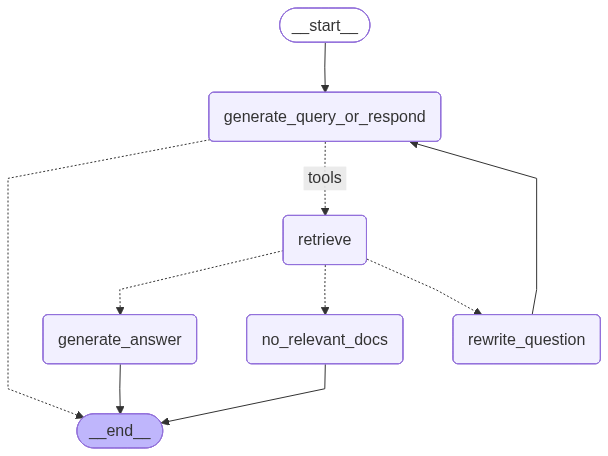
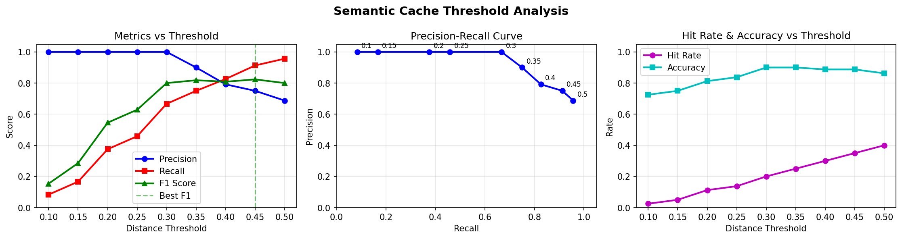

# SwiftRAG--Retrieval-Augmented-Generation-with-Semantic-Caching-Intelligent-Reranking

> A production-grade RAG system featuring a multi-strategy semantic cache, a neural reranking pipeline, an interactive evaluation dashboard, and a fully functional AI chatbot — all built on top of LangGraph, ChromaDB, and Streamlit.

---

## Table of Contents

- [What Is This Project?](#what-is-this-project)
- [Use Cases](#use-cases)
- [System Architecture](#system-architecture)
- [How Semantic Caching Works](#how-semantic-caching-works)
- [Evaluation Dashboard](#evaluation-dashboard)
- [RAG Chatbot (TaskFlow Assistant)](#rag-chatbot-taskflow-assistant)
- [Project Structure](#project-structure)
- [Getting Started](#getting-started)
- [Tech Stack](#tech-stack)

---

## What Is This Project?

**CacheLab RAG** is an end-to-end Retrieval-Augmented Generation system that demonstrates how to dramatically reduce LLM API costs and latency by layering a **semantic cache** in front of a full RAG pipeline.

Instead of sending every user query to the LLM and vector database, the system first checks whether a semantically equivalent question has already been answered. If it has, the cached answer is returned in milliseconds — no embedding lookup, no document retrieval, no LLM call. Only genuine cache misses fall through to the complete RAG pipeline.

The project ships two standalone applications:

| Application | Description |
|---|---|
| **TaskFlow Assistant** | A production-ready RAG chatbot with live semantic caching, user feedback loops, and conversation history |
| **Semantic Cache Analyzer** | A 5-page evaluation dashboard for benchmarking and optimising cache strategies, thresholds, and rerankers |

Both are backed by the **`cachelab`** Python library — a reusable, evaluatable caching layer that implements exact-match, fuzzy-match, and semantic-match strategies together with three reranking approaches.

---

## Use Cases

| Domain | How It Helps |
|---|---|
| **Customer Support** | Cache repetitive FAQs; route novel complaints to human agents |
| **E-Commerce** | Instant answers to shipping/returns questions; complex queries hit the catalogue |
| **Healthcare** | Cache policy and eligibility questions; send clinical queries to verified RAG pipeline |
| **Enterprise Knowledge Base** | Reduce OpenAI/Groq spend by 40–70% by serving repeated internal queries from cache |
| **Developer Tooling** | Accelerate IDE assistants with semantic short-circuit for documentation lookups |

---

## System Architecture

### Pipeline Flow

```
User Query
    │
    ▼
┌─────────────────────┐
│   Semantic Cache    │  ← HuggingFace embeddings (all-MiniLM-L6-v2)
│  cosine distance    │    threshold: configurable (default 0.1–0.3)
└──────┬──────────────┘
       │
   ┌───┴────┐
   │        │
  HIT      MISS
   │        │
   ▼        ▼
Return   LangGraph RAG Pipeline
Cached        │
Answer    ┌───▼──────────────┐
(< 50ms)  │  ChromaDB        │  vector similarity / MMR search
          │  Retrieval (k=4) │
          └───┬──────────────┘
              │
          ┌───▼──────────────┐
          │  Document Grader │  LLM grades relevance of retrieved docs
          └───┬──────────────┘
              │
       ┌──────┴──────┐
       │             │
   Relevant    Not Relevant
       │             │
       ▼             ▼
  Generate     Rewrite Query
   Answer      (max 2 retries)
       │             │
       └──────┬──────┘
              │
         ┌────▼──────┐
         │  Response  │ → optionally written to cache
         └───────────┘
```

### Flowchart



---

## How Semantic Caching Works

Traditional caches use exact string matching — a single extra space or synonym causes a complete miss. Semantic caching replaces string equality with **vector similarity**.

### Step-by-Step Mechanism

```
1. Incoming query is encoded → 384-dimensional embedding vector

2. Cosine distance is computed against every cached question vector

3. If min(distance) < threshold  →  CACHE HIT  → return stored answer
   If min(distance) ≥ threshold  →  CACHE MISS → forward to RAG pipeline

4. On a miss, the LLM-generated answer can be approved by the user
   and written back into the cache for future queries
```

### Cache Strategies Compared

| Strategy | Handles Typos | Handles Paraphrases | Speed | Accuracy |
|---|---|---|---|---|
| **Exact Match** | No | No | Fastest | Low recall |
| **Fuzzy Match** | Yes | Partial | Fast | Moderate |
| **Semantic Match** | Yes | Yes | Moderate | High |
| **Semantic + Reranker** | Yes | Yes | Slower | Highest |

### Reranking Stage

Because semantic retrieval can return false positives (similar-sounding but different-intent queries), a **reranking stage** validates candidates before serving them:

| Reranker | Mechanism | Latency | Best For |
|---|---|---|---|
| **Simple Keyword** | Token overlap score | ~1 ms | High-throughput, low-precision needs |
| **Cross-Encoder** | Neural pairwise scoring | ~50 ms | Balance of speed and accuracy |
| **LLM Reranker** | GPT reasoning + structured output | ~500 ms | Maximum precision, cost-tolerant |

### Threshold Trade-Off

The distance threshold is the single most important hyperparameter:

- **Lower threshold** (e.g. 0.1) → fewer false positives, more LLM calls
- **Higher threshold** (e.g. 0.5) → higher hit rate, risk of wrong cached answers

The evaluation dashboard provides data-driven tools to find your optimal threshold.



---

## Evaluation Dashboard

The **Semantic Cache Analyzer** is a 5-page Streamlit application for benchmarking cache strategies against labelled test data.

### Screenshot

<!-- Replace with your screenshot -->


### Pages

| Page | Purpose |
|---|---|
| **Landing** | Overview and feature navigation |
| **About** | Deep-dive educational content on caching, embeddings, reranking |
| **Data** | Upload ground-truth FAQ and test query datasets |
| **Testing** | Run live experiments — strategy, threshold, model, confusion matrix |
| **Optimization** | Systematic sweep across thresholds and models; precision-recall curves |
| **Reranker** | Side-by-side comparison of all four reranking strategies |

### Key Metrics Tracked

- Precision · Recall · F1 · Accuracy
- True Positives / True Negatives / False Positives / False Negatives
- Hit Rate · Average Cosine Distance
- Query-level distance distributions (histogram + box plot)
- Inference speed benchmarks

### Running the Dashboard

```bash
cd evaluation_dashboard
pip install -r requirements.txt
pip install -e src/   # install cachelab library
streamlit run app.py
```

See [evaluation_dashboard/README.md](evaluation_dashboard/README.md) for full details.

---

## RAG Chatbot (TaskFlow Assistant)

The **TaskFlow Assistant** is a domain-specific RAG chatbot for the fictional *TaskFlow* project management platform. It demonstrates semantic caching in a real conversational context.

### Screenshot

<!-- Replace with your screenshot -->


### Features

- Real-time chat interface with conversation history
- Live **cache hit/miss status** on every response (with similarity score)
- Adjustable **similarity threshold slider** (0.0 – 0.6) in the sidebar
- **Session statistics** — total queries, cache hits, hit rate
- **User feedback loop** — approve answers to add them to the cache
- Downloadable cache export (CSV)
- Automatic **question rewriting** on retrieval failure (up to 2 retries)
- Graceful **fallback answers** when no relevant documents are found

### Running the Chatbot

```bash
cd RAG_chatbot_with_semantic_caching
# Set GROQ_API_KEY in .env
streamlit run rag_app.py
```

See [RAG_chatbot_with_semantic_caching/README.md](RAG_chatbot_with_semantic_caching/README.md) for full details.

---

## Project Structure

```
CacheLab RAG/
├── README.md
├── .env                          # API keys (OPENAI_API_KEY, GROQ_API_KEY)
├── requirements.txt              # Root dependencies
├── rag_with_semantic_caching_reranking_analysis.ipynb  # Analysis notebook
│
├── RAG_chatbot_with_semantic_caching/
│   ├── rag_app.py                # Streamlit chatbot UI
│   ├── cached_rag_chatbot_chroma.py   # Core RAG + cache orchestrator
│   ├── semantic_cache.py         # In-memory semantic cache
│   ├── document_store_chroma.py  # ChromaDB vector store
│   ├── prepare_chromadb.py       # Data ingestion & setup
│   ├── test_complete_flow.py     # Integration tests
│   ├── data/
│   │   ├── taskflow_faq.csv
│   │   ├── taskflow_docs.txt
│   │   └── taskflow_cache_seed.csv
│   └── outputs/
│       └── langgraph_flow.png    # Workflow diagram
│
└── evaluation_dashboard/
    ├── app.py                    # Landing page
    ├── requirements.txt
    ├── pyproject.toml            # cachelab package config
    ├── pages/
    │   ├── 1_about.py
    │   ├── 2_data.py
    │   ├── 3_testing.py
    │   ├── 4_optimization.py
    │   └── 5_reranker.py
    ├── src/cachelab/
    │   ├── cache/                # Exact, fuzzy, semantic strategies
    │   ├── reranker/             # Keyword, cross-encoder, LLM rerankers
    │   ├── evaluate/             # Metrics and evaluation harness
    │   └── utils/                # Embedding and cache utilities
    ├── data/
    │   ├── ground_truth.csv
    │   └── test_dataset.csv
    └── visualizations/
        └── threshold_analysis.png
```

---

## Getting Started

### Prerequisites

- Python 3.11+
- [Groq API key](https://console.groq.com) (for the chatbot LLM)
- [OpenAI API key](https://platform.openai.com) (for LLM reranker in dashboard)

### Installation

```bash
git clone <repo-url>
cd RAG_with_semantic_caching_and_reranking

# Install root dependencies
pip install -r requirements.txt

# Evaluation dashboard
cd evaluation_dashboard
pip install -r requirements.txt
pip install -e src/

# RAG chatbot
cd ../RAG_chatbot_with_semantic_caching
pip install langchain langchain-huggingface langchain-chroma langchain-groq langgraph python-dotenv
```

### Environment Variables

Create a `.env` file in the project root:

```env
OPENAI_API_KEY=sk-...
GROQ_API_KEY=gsk_...
```

### Initialise the ChromaDB Vector Store

```bash
cd RAG_chatbot_with_semantic_caching
python prepare_chromadb.py
```

---

## Tech Stack

| Layer | Technology |
|---|---|
| LLM | Groq · llama-3.3-70b-versatile |
| LLM Reranker | OpenAI GPT (structured output) |
| Vector Store | ChromaDB (persistent) |
| Embeddings | HuggingFace · all-MiniLM-L6-v2 |
| Workflow Orchestration | LangGraph |
| UI Framework | Streamlit |
| Visualisation | Plotly |
| Data | Pandas · NumPy |
| Neural Reranker | sentence-transformers cross-encoder |
| Packaging | pyproject.toml (cachelab v0.1.0) |

---

*Built to demonstrate production-grade semantic caching patterns for RAG systems.*
